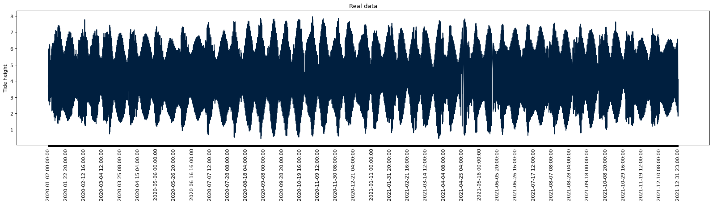
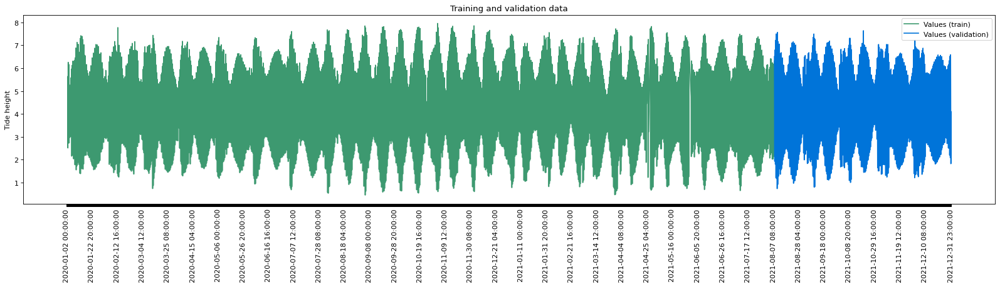
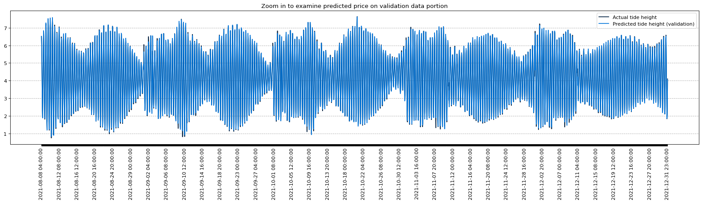
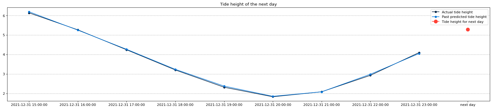

# LSTM model with PyTorch

#### Real data preparation

#### Training and validation sets

#### Model evaluation

#### Predicting future tide weight

Predicted tide height of the next day: 5.29 m. 

Actual tide heght : 5.32m
